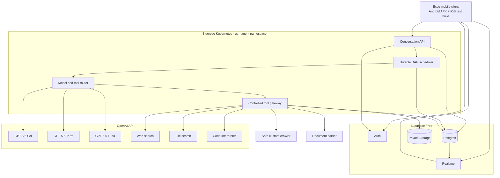
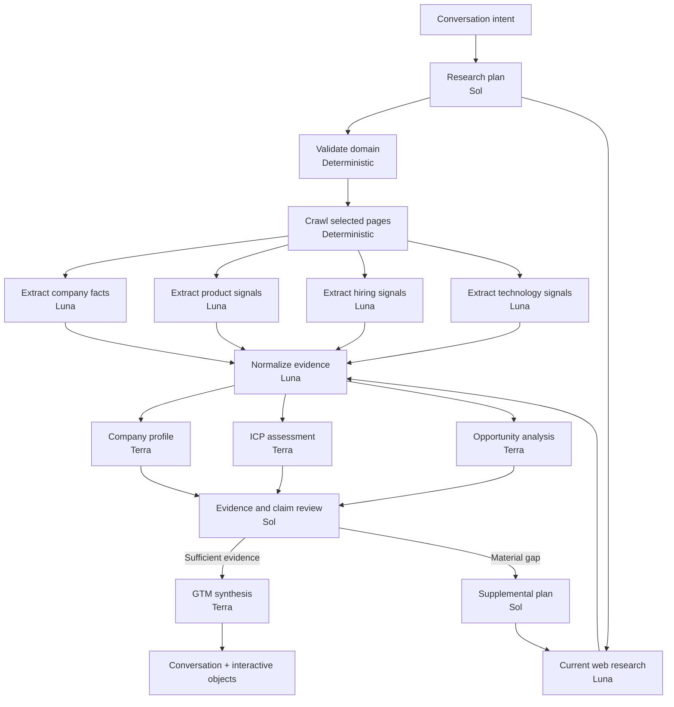

# Conversational GTM Orchestrator — MVP Implementation Plan

Status: Approved planning baseline
Date: 2026-08-01
Delivery target: Android APK backed by the existing Bluerose Kubernetes server and Supabase Free infrastructure

## 1. Product outcome

Build a conversational GTM research agent for a freelancer or agency selling AI and agent automation.

The operator submits one company domain, or a small batch of domains, and converses with a single GTM agent. Behind that conversation, a model-aware durable DAG coordinates specialist agents and mandatory research tools to determine:

- What the company does and how it operates.
- Whether it fits the agency's ICP.
- The advantages and disadvantages of pursuing it.
- Which AI or agent-automation opportunities are credible.
- Which evidence supports each conclusion.
- Which assumptions still require validation.
- What entry offer, buyer role, positioning, and discovery questions are appropriate.

The MVP is successful when the operator can install the APK, complete seller-profile onboarding, analyze a real domain, inspect evidence, challenge conclusions conversationally, shortlist an opportunity, and resume the work after restarting the app.

## 2. Product principles

1. **Conversation is the control surface.** Reports and scores are durable objects created and manipulated through conversation.
2. **One user-facing agent.** Specialist agents work behind the scenes and never create a confusing multi-bot conversation.
3. **Evidence before recommendation.** Material claims must point to sources.
4. **Facts, inferences, and hypotheses are distinct.** Unverified internal-process assumptions become discovery questions.
5. **The workflow is an application-owned DAG.** Dependencies, retries, budgets, conditional branches, and completion rules are deterministic and durable.
6. **Routing is model-aware and tool-aware.** Each DAG node declares its model and tool policy.
7. **External actions remain human-controlled.** The MVP prepares sales material but does not send outreach or modify external systems.
8. **No-new-hosting-cost infrastructure is a constraint.** The backend uses a small isolated workload on the existing Bluerose Kubernetes server and a separate Supabase Free project. OpenAI API usage remains a variable cost.

## 3. MVP scope

### Included

- Android APK built with React Native and Expo.
- Shared iOS build verified through Xcode Simulator, with a physical-device smoke test when an iPhone is available.
- Single-operator authentication.
- Conversational seller-profile onboarding and editing.
- One-domain analysis followed by batches of up to five domains.
- Safe target-site crawling.
- Current web research with citations.
- Reading uploaded PDF, DOCX, PPTX, HTML, Markdown, text, JSON, and CSV files.
- Model-aware Sol, Terra, and Luna routing.
- Durable DAG execution with checkpoints and recovery.
- ICP scoring with explainable dimensions.
- Prospect pros and cons.
- Three ranked, company-specific automation opportunities.
- Evidence, source, confidence, and assumption tracking.
- Conversational follow-up and corrections.
- Dynamic interactive objects.
- Small-batch comparison and prioritization.
- Markdown or JSON export.

### Deferred

- Automated email, LinkedIn, or CRM writes.
- Continuous company monitoring.
- Voice conversation.
- iOS App Store and TestFlight distribution. iOS functional testing remains in scope.
- Batches larger than five domains.
- Paid enrichment providers.
- Multi-user agency workspaces.
- Subscription billing.
- Autonomous prompt or scoring modification.

## 4. System architecture



The APK contains presentation, local drafts, session management, and realtime subscriptions. Model credentials, privileged Supabase credentials, crawling, orchestration, and tool execution remain in the Bluerose API workload.

## 5. Model-aware orchestration

The model registry is configuration, not scattered hardcoded strings.

| Role | Preferred model | Primary responsibility |
|---|---|---|
| Planner | `gpt-5.6-sol` | Interpret intent, design the research DAG, define completion criteria |
| Executor | `gpt-5.6-luna` | High-volume extraction, classification, normalization, bounded tool tasks |
| Analyst | `gpt-5.6-terra` | Company profiling, ICP scoring, opportunity reasoning |
| Conversation manager | `gpt-5.6-terra` | Follow-ups, corrections, ordinary synthesis |
| Critic | `gpt-5.6-sol` | Challenge claims, reconcile conflicts, validate the final dossier |
| Portfolio strategist | `gpt-5.6-sol` | Compare and rank the most important targets in a batch |

Default routing configuration:

```text
MODEL_PLANNER=gpt-5.6-sol
MODEL_EXECUTOR=gpt-5.6-luna
MODEL_ANALYST=gpt-5.6-terra
MODEL_CRITIC=gpt-5.6-sol
MODEL_CONVERSATION=gpt-5.6-terra
```

Fallback policy:

- Sol may fall back to Terra for ordinary planning, but not silently for the final high-value critical review.
- Terra may fall back to Sol for important analysis.
- Luna may fall back to Terra for bounded extraction.
- Luna must not replace Sol for planning or critical review.
- Model availability must be verified against the connected OpenAI project before live implementation.

OpenAI's hosted Responses Multi-agent feature is not the primary workflow engine. It is beta, uses the same request model and tool set for the root and its subagents, and is unsuitable for the core Sol-to-Luna-to-Terra DAG. It may later be used inside one same-model DAG node when bounded parallel exploration is beneficial.

## 6. Research DAG



Supplemental research is capped at one loop in the MVP. A low-fit company can terminate early after profiling and ICP assessment, while preserving its evidence and explanation.

### DAG node contract

Every node declares:

- Dependencies and conditional edges.
- Input and output schemas.
- Preferred and fallback model policy.
- Reasoning effort.
- Allowed and required tools.
- Timeout, retry, concurrency, token, and cost budgets.
- Evidence and citation requirements.
- Completion and failure criteria.

Node states:

```text
pending -> ready -> running -> completed
                     |-> retrying
                     |-> failed
                     |-> blocked
                     |-> skipped
```

A node becomes ready only when its dependencies have completed, its edge condition is true, its concurrency group has capacity, and the workflow remains inside its budgets.

## 7. Mandatory tool gateway

Tool access is scoped per DAG node. No agent receives unrestricted access to every tool.

### OpenAI-hosted tools

- `web_search`: current company, funding, hiring, leadership, launch, market, and competitor research with citations and source lists.
- `file_search`: semantic and keyword retrieval from uploaded document knowledge bases.
- Code Interpreter: CSV cleanup, numerical comparison, scoring diagnostics, deduplication, and chart/export generation when deterministic code is insufficient.

### Custom tools

```text
validate_domain
crawl_company
fetch_page
read_document
extract_document_text
search_evidence
get_claim_sources
list_open_hypotheses
get_seller_profile
get_icp_definition
get_company_profile
get_opportunities
compare_companies
save_evidence
record_user_correction
```

### Future MCP tools

The gateway supports explicitly approved remote MCP integrations for CRM, Drive, Notion, Slack, Calendar, and company-data providers. These are deferred from the free MVP unless a read-only integration materially improves validation.

### Per-role tool access

| Agent | Tool policy |
|---|---|
| Sol planner | Read seller profile, ICP definition, evidence catalog, and create a research plan |
| Luna executor | Web search, crawl, read documents, extract, normalize, save evidence |
| Terra analyst | Evidence retrieval, file search, structured analysis, comparison |
| Sol critic | Claim verification, independent web search, source inspection, contradiction detection |
| Terra conversation manager | Read-only evidence and objects, record corrections, propose actions |

Research is enforced rather than suggested. A node fails validation if a required tool was not used or its minimum evidence requirements were not met.

## 8. Evidence and document architecture

Every material conclusion follows this chain:

```text
Source -> Evidence -> Claim -> Company signal -> Opportunity -> Sales recommendation
```

Evidence records include:

- Company and workflow identifiers.
- Tool name and source type.
- Source URL or document identifier.
- Title and observation date.
- Extracted text.
- Normalized claim.
- Fact, inference, or hypothesis classification.
- Content hash.
- Confidence.
- Citation metadata.

Document lifecycle:

1. Store the original in private Supabase Storage.
2. Validate MIME type and size.
3. Extract safe text and metadata.
4. For large or reusable collections, upload a processing copy to an OpenAI vector store.
5. Store OpenAI file and vector-store identifiers without exposing them to other users.
6. Preserve file citations in the evidence ledger.
7. Delete the Supabase and OpenAI copies together when the user deletes the document.

## 9. Interactive mobile objects

The mobile app renders trusted schema-driven components:

- `WorkflowProgressCard`
- `CompanyProfileCard`
- `ICPScoreCard`
- `OpportunityCard`
- `EvidenceDrawer`
- `CompanyComparisonCard`

The model produces validated data, not executable React Native code. Objects are stored independently of chat messages, versioned, and updated through realtime patches.

Example progress object:

```text
Researching Acme

✓ Research plan                  Sol
✓ Website crawl                  System
✓ Evidence extraction            Luna - 4 tasks
● ICP and opportunity analysis   Terra - 2 tasks
○ Critical review                Sol
○ GTM synthesis                  Terra

[View evidence] [Pause] [Cancel]
```

### Canonical approved visual baseline

The approved prototype at `docs/images/conversational-gtm-prototype.png` is the visual source of truth for the MVP. Its immutable binary fingerprint and replacement policy are recorded in `docs/images/REFERENCE_LOCK.md`. It is a fidelity target, not loose inspiration. Implementation must preserve its composition, information hierarchy, copy, typography scale, spacing, colors, borders, radii, icon scale, restrained shadows, card density, bottom composer, and conversational emphasis.

The three canonical UI states are:

1. **Research progress:** the user request, assistant acknowledgement, and inline `Researching Acme` orchestration card with Sol, Luna, and Terra status rows.
2. **Company assessment:** the Acme profile, ICP fit, company facts, pros and cons, recommended opportunity, impact and value/effort/fit indicators, plus Evidence, Challenge, and Shortlist actions.
3. **Evidence inspection:** the evidence drawer with claim explanation, source cards, URLs, Fact/Inference labels, confidence indicators, and the persistent conversational composer.

These screens must remain conversation-first. They must not be converted into a generic dashboard, bento grid, or differently styled card system. Palette substitutions, component restyling, content reordering, additional navigation chrome, or unexplained decorative elements require explicit user approval before implementation.

Permitted platform adaptations are limited to Android and iOS safe areas, system status/navigation chrome, native keyboard behavior, accessibility and dynamic-type requirements, reduced motion, and unavoidable device-size constraints. Those adaptations must preserve the reference composition and visual character.

Implementation rules:

- Recreate reusable components from the approved reference while wiring them to real interactive-object schemas and data contracts.
- Treat the presentation board as three separate mobile screens at runtime; do not render the three-phone board inside the application.
- Use the prototype copy and fixture values for the canonical screenshot fixtures so comparisons remain deterministic.
- Do not approve placeholder content, generic icons, or approximate typography as final visual completion.
- Any intentional departure must be documented with a before/after comparison and explicitly approved.

## 10. Supabase design

A new Supabase Free project must be created for this MVP. The existing `seo-audit-prospector` project is unrelated and must not be reused.

Core tables:

```text
profiles
seller_profiles
icp_definitions
conversations
messages
companies
company_domains
workflow_templates
workflow_runs
workflow_nodes
node_dependencies
node_attempts
node_artifacts
model_invocations
tool_invocations
evidence
claims
icp_assessments
opportunities
interactive_objects
feedback_events
```

Private Storage buckets:

```text
research-sources
user-uploads
exports
```

Security requirements:

- Enable RLS on every table in an exposed schema.
- Explicitly configure Data API exposure and grants.
- Restrict rows by authenticated user or workspace ownership.
- Use both `USING` and `WITH CHECK` for update policies.
- Use private Storage buckets with ownership policies.
- Never use user-editable metadata for authorization.
- Never expose Supabase secret/service-role credentials in the APK.
- Run security and performance advisors after schema changes.
- Test anonymous, owner, and cross-user access paths.

## 11. Bluerose deployment

The deployment contains one API workload in a dedicated `gtm-agent` Kubernetes namespace running:

- Conversation API.
- DAG scheduler.
- Node executor.
- Safe crawler.
- Tool gateway.
- OpenAI API integration.
- Supabase privileged integration.

There is no application database or persistent volume on Bluerose. Supabase remains the durable data, authentication, Storage, and Realtime layer.

The service checkpoints every node attempt in Supabase. If the pod restarts or is rescheduled, the next request resumes from the first incomplete node without repeating completed work.

Required deployment configuration:

- Immutable GHCR image built with Node.js 22.
- A ClusterIP service exposed only through the existing Cloudflare Tunnel.
- Liveness and readiness endpoints.
- Graceful shutdown.
- Resume-incomplete-workflow startup check.
- Structured logging with workflow and node IDs.
- Environment validation.
- Page, call, token, time, concurrency, and cost budgets.
- Explicit CPU and memory requests and limits sized for the shared single-node cluster.
- A pinned rollback image and Kubernetes rollout history.

Secrets stored only in the `gtm-agent-api-secrets` Kubernetes Secret:

```text
OPENAI_API_KEY
SUPABASE_URL
SUPABASE_PUBLISHABLE_KEY
SUPABASE_SECRET_KEY
```

Public configuration allowed in the APK:

```text
SUPABASE_URL
SUPABASE_PUBLISHABLE_KEY
EXPO_PUBLIC_API_BASE_URL
```

## 12. Repository structure

```text
apps/
  mobile/                 Expo Android application
  api/                    Bluerose-hosted Fastify API

packages/
  contracts/              Shared schemas and events
  domain/                 Company, evidence, ICP, opportunity models
  conversation/           Context and message logic
  orchestration/          DAG scheduler and workflow templates
  agents/                 Sol, Terra, and Luna agent definitions
  tools/                  Controlled tool gateway and adapters
  crawler/                URL validation and safe crawling
  documents/              Parsing and ingestion
  ui-objects/             Interactive-object schemas
  supabase/               Typed data access
  evaluations/            Agent, tool, routing, and quality evals

supabase/
  migrations/
  seed.sql
  tests/

Dockerfile
deploy/bluerose/deployment.yaml
```

## 13. Implementation milestones

### Milestone 1 — Product and schema contracts

- Define seller profile and ICP dimensions.
- Define evidence, claim, opportunity, object, DAG, model, and tool-policy schemas.
- Create representative fixture-company dossiers.
- Define quality and cost baselines.

Exit criterion: multiple fixture companies can be assessed consistently using the same contracts.

### Milestone 2 — Greenfield foundation

- Scaffold the TypeScript monorepo.
- Create the cross-platform Expo client and Node.js 22 API.
- Add shared runtime validation, tests, logs, and health endpoints.
- Add provider-neutral model and tool interfaces.

Exit criterion: mobile client reaches the local API and receives a validated fixture response.

### Milestone 3 — Supabase

- Create the separate free project.
- Add migrations, Auth, RLS, Storage, and Realtime.
- Generate TypeScript types.
- Run advisors and cross-user isolation tests.

Exit criterion: two test users cannot access each other's conversations, objects, evidence, or files.

### Milestone 4 — DAG scheduler without AI

- Implement dependencies, conditions, retries, timeouts, concurrency groups, budgets, checkpoints, cancellation, and resume.
- Test with deterministic fake nodes and injected failures.

Exit criterion: a stopped workflow resumes without duplicating successful nodes.

### Milestone 5 — Conversation and interactive objects

- Implement conversation persistence and seller-profile onboarding.
- Render fixture company analysis.
- Implement the six object types and realtime patches.
- Support corrections and conversation resumption.

Exit criterion: the APK can hold a realistic fixture-company conversation and persist object interactions.

### Milestone 6 — Research and document tools

- Implement safe domain validation and crawling.
- Add OpenAI web search with citations.
- Add document parsing, Storage lifecycle, and file search.
- Add normalized evidence and citation storage.
- Add prompt-injection isolation.

Exit criterion: one real domain and one uploaded document produce traceable evidence records.

### Milestone 7 — Model-aware agents

- Implement Sol planning.
- Implement Luna extraction and normalization.
- Implement Terra profiling, ICP scoring, and opportunity analysis.
- Implement Sol critical review.
- Validate model fallbacks and per-node tool restrictions.

Exit criterion: one real domain produces a complete, evidence-backed dossier through the intended model and tool routes.

### Milestone 8 — Batch comparison

- Support up to five domains.
- Run independent per-domain subgraphs with bounded concurrency.
- Isolate per-company failures.
- Add comparison, ranking, and pursue/research/nurture/reject states.

Exit criterion: a five-domain batch completes when one target fails and explains the ranking of the remaining targets.

### Milestone 9 — Bluerose and mobile builds

- Build and smoke-test the production API container locally.
- Add and validate the isolated Bluerose Kubernetes manifest.
- Inspect cluster capacity and protected workloads before deployment.
- Configure Kubernetes secrets without exposing their values.
- Deploy the pinned image and verify pod restart and workflow-resume behavior.
- Publish only the healthy ClusterIP service through a dedicated Cloudflare Tunnel hostname.
- Build and sign the Android APK.
- Build the iOS test target.
- Run the mobile E2E suite on Android Emulator and Xcode Simulator.
- Test the APK on a physical Android device.
- Run a physical-iPhone smoke test when a device is available.

Exit criterion: the installed APK and the iOS Simulator build complete the production domain-analysis journey against Bluerose and Supabase, with no platform-specific blocking defect.

### Milestone 10 — Release qualification

- Run the complete unit, contract, API, database, integration, mobile, security, and E2E suites.
- Run bounded live OpenAI routing and tool-use evaluations with an explicit spend ceiling.
- Run the deployed Bluerose/Supabase smoke and recovery suites.
- Verify test-data cleanup and inspect production-like logs for leaked secrets or unhandled errors.
- Produce a release evidence report containing commands, versions, pass counts, failures, and accepted limitations.

Exit criterion: every mandatory quality gate below passes from a clean checkout and the release evidence report contains no unresolved severity-one or severity-two defect.

## 14. Evaluation and verification

Testing is part of every milestone, not a final cleanup phase. Model calls are mocked for deterministic CI unless a test is explicitly assigned to the bounded live-OpenAI lane.

### Test environments

| Environment | Purpose | External services |
|---|---|---|
| Local | Development, unit, API, database, and deterministic E2E | Local Supabase; fake OpenAI and fixture web server |
| CI | Clean, repeatable merge gate | Ephemeral local Supabase; fake OpenAI and fixture web server |
| Live test | Bounded provider and tool verification | Supabase test data, Bluerose deployment, live OpenAI with spend cap |
| Production MVP | Final smoke and operator use | Existing Bluerose Kubernetes server and dedicated Supabase MVP project |

Tests must use synthetic users, domains, documents, and cleanup tokens. Cleanup fails closed unless the expected test marker and exact cleanup token are present.

### Unit tests

- Seller-profile and ICP scoring rules.
- Evidence, claim, opportunity, and interactive-object validation.
- DAG dependency resolution and condition evaluation.
- Model and tool policy selection.
- Retry, timeout, budget, and fallback calculations.
- URL canonicalization and private-address rejection.
- Citation normalization and fact/inference/hypothesis classification.
- Realtime event reducers and mobile object rendering state.
- Offline draft and reconnection state machines.

All deterministic domain logic requires unit coverage for successful, boundary, and failure cases.

### Contract and schema tests

- Generate and validate an OpenAPI contract for the public backend API.
- Validate every request, response, event, DAG node output, and interactive-object payload against shared schemas.
- Verify mobile and backend packages compile against the same contract version.
- Detect backward-incompatible API or realtime-event changes in CI.
- Maintain golden fixtures for every interactive-object type and every agent output schema.

### API tests

Exercise the running HTTP server rather than calling route handlers directly:

- Health and readiness endpoints.
- Authentication, expired token, invalid token, and missing token behavior.
- Conversation creation, pagination, and ownership.
- Message submission and idempotency.
- Domain and batch validation.
- Workflow start, status, pause, cancellation, and resume.
- Interactive-object action validation and stale-version rejection.
- File upload metadata, size, type, and authorization checks.
- Realtime/SSE or WebSocket authentication, reconnect, replay, and ordering.
- Rate limiting and research-budget exhaustion.
- Consistent error envelope and correlation IDs.
- Malformed JSON, oversized bodies, unavailable dependencies, and timeout behavior.

API tests use a real test database and assert both the HTTP response and resulting persisted state.

### Supabase and database tests

- Apply all migrations from an empty database.
- Validate foreign keys, uniqueness, check constraints, indexes, and cascade behavior.
- Test RLS as anonymous, authenticated owner, another user, and privileged backend roles.
- Test `USING` and `WITH CHECK` behavior on updates.
- Test private Storage upload, read, replacement, and deletion policies.
- Test Realtime publication scope and cross-user isolation.
- Verify transaction rollback on partially failed node completion.
- Verify node claiming prevents duplicate execution.
- Run Supabase security and performance advisors after schema changes.
- Verify a backup/export can be restored into a clean local instance.

### API-to-database integration tests

- Start a workflow through the API and verify its full persisted node graph.
- Claim, execute, checkpoint, and complete nodes through the real repository layer.
- Restart the API between node attempts and verify recovery.
- Cancel a workflow while a node is running and verify terminal state consistency.
- Deliver database changes through Realtime and confirm the mobile reducer reaches the expected state.
- Upload a document, persist its metadata, process it, cite it, and delete all derived artifacts.

### Model adapter tests

- Mock the OpenAI Responses API for deterministic unit and integration tests.
- Validate Sol, Terra, and Luna request construction independently.
- Validate reasoning effort, tool policy, structured-output schema, and correlation metadata.
- Test refusal, timeout, rate-limit, invalid-schema, incomplete-response, and provider-error handling.
- Test permitted fallback and prohibited fallback routes.
- Ensure raw provider output cannot bypass node-output validation.
- Ensure usage, latency, model, response ID, and estimated cost are recorded.

### Bounded live OpenAI evaluations

Live tests are separate from the normal CI lane and require an explicit maximum spend:

- Confirm the connected OpenAI project can access Sol, Terra, and Luna.
- Confirm hosted web search returns citations and source metadata.
- Confirm file search retrieves and cites a controlled test document.
- Confirm each role uses its required model and tools.
- Compare representative outputs against scored evaluation fixtures.
- Stop immediately when the per-run or overall spend ceiling is reached.

Live provider tests never run automatically on every commit.

### Workflow tests

- Dependency ordering.
- Conditional branches.
- Retry and timeout behavior.
- Cancellation.
- Budget exhaustion.
- Resume without duplicate work.
- Per-company failure isolation.
- Concurrent node claiming without duplicate execution.
- Process termination between checkpoint and completion.
- Stale-node lease recovery.
- Deterministic replay from stored artifacts.

### Model-routing tests

- Planner uses Sol.
- Bounded extraction uses Luna.
- Semantic analysis uses Terra.
- Critical review uses Sol.
- Fallbacks preserve role requirements.
- Model output passes the node's schema.

### Tool-routing tests

- Mandatory web research actually runs.
- Target-domain crawling actually runs.
- Document nodes read provided documents.
- Disallowed tools cannot be called.
- Tool limits stop runaway research.
- Citations remain attached to claims.
- Tool outputs cannot inject new instructions or permissions.
- Required tool failures produce structured incomplete-evidence results.
- File and web sources remain traceable after synthesis.
- Tool-call and download budgets are enforced under concurrency.

### Quality evaluations

- Company specificity.
- ICP consistency.
- Opportunity usefulness.
- Unsupported-claim rate.
- Evidence coverage.
- Fact/inference/hypothesis classification.
- Critic detection of weak assumptions.
- Correction handling.

### Security tests

- SSRF and DNS-rebinding resistance.
- Redirect and download limits.
- Prompt injection in webpages and documents.
- RLS and Storage isolation.
- Secret absence from APK, logs, and database rows.
- No external writes without approval.
- Broken-object-level authorization across every API resource.
- Malicious filenames, MIME mismatches, archive bombs, and oversized documents.
- Dependency, secret-scanning, and mobile-binary inspection.
- Logs and traces redact tokens, credentials, and sensitive document content.

### Integration tests

- Bluerose API with Supabase Auth, Postgres, Storage, and Realtime.
- DAG scheduler with the model adapter and controlled tool gateway.
- Crawler and document parser with the evidence pipeline.
- Evidence pipeline with company profile, ICP, opportunity, and critic nodes.
- Interactive-object persistence with realtime mobile updates.
- Batch orchestration with mixed success, retryable failure, and permanent failure.
- Kubernetes pod restart followed by workflow recovery.

Integration tests use fixture sites and fake model responses by default. A small separate lane verifies the same seams against live OpenAI and the deployed Bluerose service.

### Mobile tests

- Shared component and navigation behavior on Android and iOS.
- Authentication, logout, expiry, and token refresh.
- Realtime reconnect, event replay, duplicate events, and out-of-order events.
- Offline drafts and interrupted message submission.
- API restart and visible recovery state.
- App termination and conversation recovery.
- Narrow-screen layout, safe areas, keyboard avoidance, and orientation changes.
- Android back-button behavior and notification/deep-link handling.
- iOS safe areas, swipe navigation, keyboard behavior, and permission prompts.
- Accessibility labels, focus order, dynamic text, contrast, and reduced motion.
- Physical-device APK installation and upgrade smoke test.
- Xcode Simulator coverage for supported iPhone screen sizes.
- Physical-iPhone smoke test when a device is available.
- Canonical screenshot tests for the research-progress, company-assessment, and evidence-inspection states on Android and iOS.
- Automated visual regression plus human side-by-side review against `docs/images/conversational-gtm-prototype.png`; no unexplained structural, typographic, spacing, color, alignment, clipping, or hierarchy differences.
- Cross-platform fidelity checks with safe areas, system chrome, dynamic type, reduced motion, and the keyboard visible.

### End-to-end tests

The E2E suite drives the real mobile UI against the real API and test Supabase instance.

Mandatory journeys:

1. Register, authenticate, and complete seller-profile onboarding.
2. Submit a valid domain and observe the DAG progress object.
3. Complete a deterministic fixture-domain analysis and inspect citations.
4. Challenge an opportunity and verify the subgraph updates the existing object.
5. Correct a company assumption and verify persistence after app restart.
6. Upload a document and verify its evidence appears in the analysis.
7. Submit five domains with one forced failure and verify partial completion.
8. Cancel and resume a research run.
9. Disconnect networking mid-run, reconnect, and recover the correct state.
10. Attempt cross-user access and verify denial in both API and UI.
11. Reopen the app after a Bluerose API pod restart and complete the journey.
12. Export the completed dossier and verify its required sections and citations.

Run the deterministic E2E suite on Android Emulator and Xcode Simulator. Run a smaller deployed smoke suite on a physical Android device and, when available, a physical iPhone.

### Performance and resilience tests

- Measure non-AI API latency separately from provider latency.
- Verify bounded concurrency for five-domain batches.
- Exercise Kubernetes pod restarts and provider rate limits.
- Confirm memory remains bounded while reading maximum-size allowed documents.
- Confirm one slow domain or tool does not block unrelated ready nodes.
- Load-test realtime subscriptions and object patches at the MVP's expected single-operator scale.

### Continuous integration quality gates

Every pull request must pass:

- Formatting, linting, type checking, and dependency checks.
- Unit and contract tests.
- API and database integration tests.
- RLS and Storage policy tests.
- Deterministic DAG and tool-routing tests.
- Android and iOS application compilation.
- Deterministic mobile E2E smoke tests where the CI host supports the required simulators.

Before a release candidate:

- Full Android Emulator and iOS Simulator E2E suites.
- Bounded live OpenAI evaluations.
- Deployed Bluerose/Supabase integration and recovery tests.
- Physical Android smoke test.
- Physical iPhone smoke test when available.
- Security scan and release evidence report.

## 15. Final acceptance criteria

The MVP is complete only when:

1. The APK installs on a physical Android device.
2. The same primary journeys pass on Xcode Simulator without a platform-specific blocking defect.
3. A new user can authenticate and complete conversational seller-profile onboarding.
4. A valid public domain can be analyzed without manual backend intervention.
5. The DAG visibly routes tasks through the intended Sol, Luna, and Terra roles.
6. Required web, crawl, document, and evidence tools execute according to node policy.
7. Material claims include inspectable sources and observation dates.
8. Facts, inferences, and hypotheses remain distinguishable.
9. The skeptic identifies unsupported recommendations.
10. Interactive objects update in place and persist across restarts.
11. A failed or interrupted workflow resumes without duplicating completed work.
12. A five-domain batch tolerates one failed target.
13. Cross-user access is denied by API authorization, RLS, and Storage policies.
14. Unit, contract, API, database, integration, security, mobile, and E2E quality gates pass from a clean checkout.
15. The deployed Bluerose/Supabase smoke and recovery suite passes.
16. Bounded live OpenAI tests confirm model routing, web search, file search, citations, and usage recording.
17. The Android and iOS application builds contain no privileged OpenAI or Supabase credentials.
18. The system performs no autonomous outreach or external writes.
19. The release evidence report contains no unresolved severity-one or severity-two defect.
20. Android and iOS implementations match the approved canonical prototype across all three UI states, with every intentional deviation documented and explicitly approved.

## 16. Current readiness

- Repository: greenfield implementation on `codex/gtm-orchestrator-mvp`, freshly indexed with a persisted graph artifact.
- Bluerose access: confirmed through the hardened SSH wrapper; Kubernetes control plane and node are healthy.
- Protected services: Portfolio and Cloudflare Tunnel remain healthy and untouched; the Portfolio endpoint returned HTTP 200 three times during pre-deployment inspection.
- Bluerose API contract: dedicated namespace, ClusterIP service, health probes, resource bounds, secret references, and pinned-image placeholder are locally validated.
- Supabase account access: confirmed.
- Existing Supabase project: unrelated and protected from reuse.
- New Supabase MVP project: not yet created.
- OpenAI API key: existing local key reused without exposing its value; bounded live calls remain gated by an explicit spend ceiling.
- Canonical mobile visual baseline: approved at `docs/images/conversational-gtm-prototype.png` and locked as the implementation source of truth.
- Foundation implementation: monorepo, locked-design client/prototype, API surface, model-aware DAG, agent/tool adapters, safe crawler, document parsers, shared contracts, Supabase migration, durable Supabase research-run and DAG-checkpoint recovery, Bluerose container/Kubernetes contract, and EAS profiles are present. The post-pivot local regression, live-local Supabase isolation/recovery lane, container smoke checks, and strict manifest validation pass.
- Remaining release work: create and verify the dedicated Supabase project, publish a pinned container, deploy it to Bluerose, add the Cloudflare route only after internal readiness, authorize Expo/EAS, install full Xcode plus Simulator runtime, exercise live OpenAI under a spend ceiling, complete the missing onboarding/upload/export paths, and pass the full Android/iOS/deployed E2E and physical-device acceptance gates.

## 17. Official platform references

- [OpenAI GPT-5.6 model guidance](https://developers.openai.com/api/docs/guides/latest-model)
- [OpenAI agent orchestration](https://developers.openai.com/tracks/building-agents#orchestration)
- [OpenAI Responses Multi-agent](https://developers.openai.com/api/docs/guides/responses-multi-agent)
- [OpenAI web search](https://developers.openai.com/api/docs/guides/tools-web-search)
- [OpenAI file search](https://developers.openai.com/api/docs/guides/tools-file-search)
- [OpenAI MCP and Connectors](https://developers.openai.com/api/docs/guides/tools-connectors-mcp)
- [Supabase Data API security](https://supabase.com/docs/guides/api/securing-your-api)
- [Supabase free-project pausing](https://supabase.com/docs/guides/platform/free-project-pausing)
- [Kubernetes Deployments](https://kubernetes.io/docs/concepts/workloads/controllers/deployment/)
- [Kubernetes probes](https://kubernetes.io/docs/concepts/configuration/liveness-readiness-startup-probes/)
